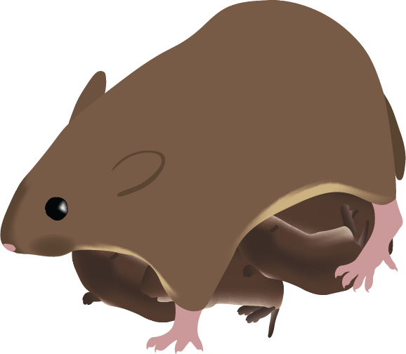
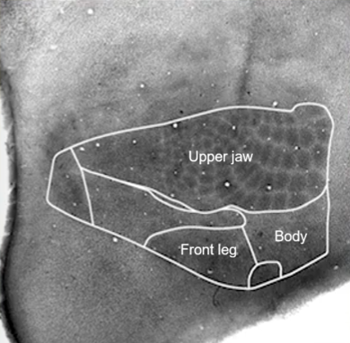

### [Graduate Research](https://www.ophirlab.com/people/)

::::: grid
::: g-col-3
 
:::

::: g-col-9
Developmental plasticity influences phenotype across an individual’s lifespan. Parental behavior, including alloparental caregiving provided by juveniles, shapes offspring behavioral and neural phenotype and enhances offspring survival. Similarly, developmental temperature impacts offspring phenotype, and acute temperature exposure affects parental behavior. However, little work has investigated how temperature and parental behavior jointly shape offspring behavioral phenotype. As part of my dissertation work, I test the hypothesis that temperature shapes offspring caregiving behavior through timing-dependent effects on parental behavior. First, I showed that acutely increasing ambient temperature led parents to cover pups less, exposing young to suboptimal temperatures more frequently (Laser and Ophir, 2026). Second, I investigated whether developmental and acute temperature interact with parenting received to affect offspring alloparenting behavior. I manipulated ambient temperature and recorded both the parental care offspring received as neonates and the alloparental behavior offspring later displayed as juveniles. Despite finding no effect of developmental temperature on offspring morphology, both developmental temperature and parenting received affected offspring alloparenting behavior. Overall, this work demonstrates that social and abiotic factors interactively shape phenotype across the lifespan and have implications for understanding development under environmental change.
:::
:::::

### [Undergraduate Research](https://blumberg.lab.uiowa.edu/lab-photos-0)

::::: grid
::: g-col-3

:::

::: g-col-9
I started working in Mark Blumberg's lab during my first year at the University of Iowa. There, I worked on projects using transgenic mice to examine how and why gene deletions associated with motor difficulties in humans can affect neural and behavioral sensorimotor development. I began by assisting in using motion tracking to analyze myoclonic twitching, which is an internally generated, single-muscle jerk that provides proprioceptive feedback to the brain important for sensorimotor development. Then, I lead two independent projects investigating whether differences in twitching contributed to differences in (1) the structure of Primary Somatosensory Cortex (S1) and (2) development of self-grooming behavior. S1 remains my favorite brain region, as it shows a topographic map of the rodent on its brain one can visualize using cytochrome oxidase (left). Overall, working on these projects started my love for research and tapped into my fascination with understanding how individuals change across time.
:::
:::::
