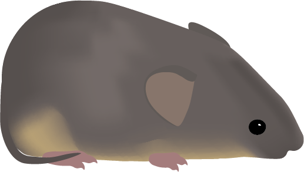

This is a test. Voles are very cute.

To do: - add research blurbs + publications list - add illustrations and crochet patterns

PDF test


::::: columns
::: {.column width="49%"}


:::

::: {.column width="2%"}
::: 

::: {.column width="49%"}


:::
:::::
